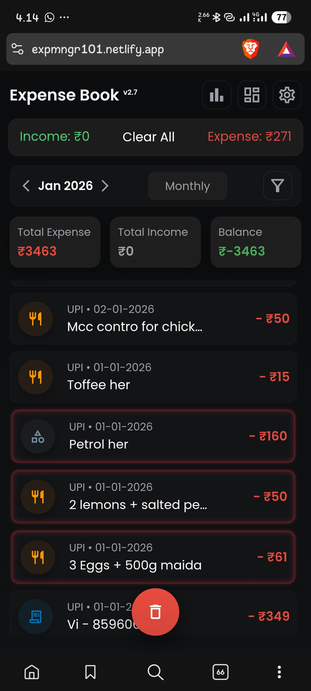

# 💰 Expense Book

Expense Book is a fast, offline-first personal finance tracker built for people who want **full control over their money data** without relying on cloud services or subscriptions.

It runs entirely inside your browser and stores everything locally using IndexedDB.

---

## ❓ Why I Created This

Most finance apps today:
- Require login
- Store data on their servers
- Track users
- Show ads
- Can lock you out if internet is unavailable

I wanted an app that:
- Works 100% offline
- Does not send data anywhere
- Does not require signup
- Gives full ownership of financial records
- Is fast, simple, and reliable

Expense Book was created to be a **private, local-first finance tracker** that behaves like a desktop app but runs in a browser.

---

## 🛠 What This App Solves

Expense Book solves these real problems:

- You don’t need internet to track money  
- You don’t lose data if a website shuts down  
- You are not locked into a company’s cloud  
- You can keep years of financial history safely  
- You can export data anytime in standard formats  
- You stay in full control of your personal finances  

It removes dependence on:
- Cloud servers
- Subscriptions
- Third-party apps
- Data selling

---

## 📸 App Screenshots

### 🏠 Home Screen

### ➕ Add Expense & Income

### 📅 Calendar View

### 🔄 Change View (Daily / Monthly / Yearly)

### ☑ Multi Select Mode

### 🔃 Sort & Filter Features

## 🚀 Features

### 🧾 Transaction Management
- Add Expense and Income
- Edit or delete any transaction
- Store amount, category, source, notes, and date/time

### 📅 Date Views
- Daily, Monthly, Yearly and All-time views
- Navigate easily using arrows and date picker

### 🔍 Live Search
- Search by notes, category, source, or amount
- Results update instantly

### 🔃 Sorting & Filtering
- Sort by date, amount, category, or source
- Filter by:
  - Expense or Income
  - Categories
  - Sources
  - Amount range
  - Date range

### 📊 Charts & Overview
- Expense by category
- Income by category
- Source breakdown
- Expense vs Income
- Monthly & Yearly summary dashboards

### 🛡 Backup & Restore
- **JSON Backup (Recommended)** – exact, safe restore
- **CSV Export** – for Excel and reports
- Restore from JSON or CSV with duplicate protection

### 🔁 Auto Backup
- Weekly or Monthly automatic backups
- Last backup date tracked

### 📄 PDF Export
- Export last 30, 60, 90 days or custom range
- Includes totals and clean formatting

### 🔐 Privacy & Offline
- Works completely offline
- Uses IndexedDB
- No login
- No cloud
- No tracking
- Data stays on your device

---

## ⚙️ Technology

- HTML, CSS, JavaScript
- IndexedDB (browser database)
- No backend
- No external frameworks

---

Expense Book is built for people who want **simple, private, and permanent control over their financial data**.
